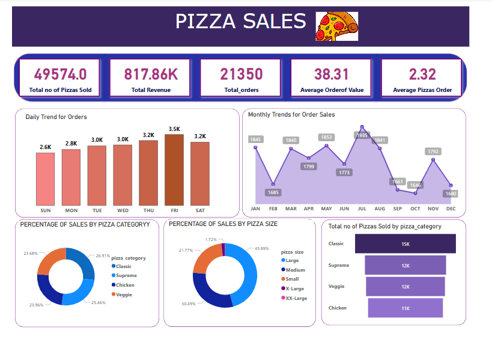

# 🍕 Pizza Sales Analysis — SQL & Power BI Dashboard

A comprehensive data analysis project exploring pizza sales trends and performance metrics using **SQL** and **Power BI**. This case study focuses on identifying key business insights such as revenue trends, product performance, and customer ordering behavior.

---

## 📌 Project Objectives

- Analyze sales performance using structured query language (SQL)
- Uncover business-critical KPIs like total revenue and average order value
- Track customer ordering trends by day and month
- Visualize sales distribution across product categories and sizes
- Highlight top-performing and underperforming pizza products
- Deliver an interactive and insightful dashboard using Power BI

---

## 🛠️ Tools & Technologies

- **SQL** – for querying, aggregating, and analyzing data
- **Power BI Desktop** – for visual analytics and dashboard design
- **CSV** – as the primary data source (pizza_sales.csv)

---

## 📦 Dataset Overview

📁 File: `pizza_sales.csv`

This dataset represents transactional sales data from a fictional pizza restaurant. It includes order-level details and product information.

| Column Name      | Description                              |
|------------------|------------------------------------------|
| `order_id`       | Unique identifier for each order         |
| `order_date`     | Date when the order was placed           |
| `pizza_name`     | Name of the pizza sold                   |
| `pizza_size`     | Pizza size (S, M, L, XL, XXL)            |
| `pizza_category` | Category (Classic, Chicken, Veggie)      |
| `quantity`       | Quantity of pizzas in the order          |
| `total_price`    | Total revenue generated by the order     |

---

## 🧮 SQL Analysis

📁 File: `pizza_sales_analysis.sql`

This analysis is structured to provide both high-level KPIs and deeper insights into customer behavior and product performance.

### 🔑 Key Metrics

- **Total Revenue**
- **Average Order Value**
- **Total Pizzas Sold**
- **Total Orders**
- **Average Pizzas per Order**

### 📈 Trend Analysis

- Order trends by **day of the week**
- Order trends by **month**

### 🧩 Distribution Metrics

- Revenue by **pizza category**
- Revenue by **pizza size**

### 🔝 Performance Insights

- Top 5 pizzas by **total revenue**
- Bottom 5 pizzas by **total revenue**

All queries are modular and organized to support further customization or use in reporting tools.

---

## 📊 Power BI Dashboard

📁 File: `pizza_sales_dashboard.pbix`

The dashboard complements the SQL analysis with a visual summary of key insights, including:

- 📈 Daily and Monthly Order Trends
- 📊 Revenue Breakdown by Category and Size
- 📦 Top and Bottom Performing Products
- 📌 KPI Summary Cards

> Open the `.pbix` file using [Power BI Desktop](https://powerbi.microsoft.com/desktop/) to interact with the visuals.

---

## 🖼️ Sample Dashboard Visual

*Overview of key KPIs and sales breakdowns, including daily trends, monthly orders, sales by category and size, and pizza popularity.*

### Key Insights Shown:
- 💰 **Total Revenue**: $817.86K
- 🍕 **Total Pizzas Sold**: 49,574
- 📦 **Total Orders**: 21,350
- ⚖️ **Average Order Value**: $38.31
- 📊 **Visuals Included**:
  - Daily and Monthly Order Trends
  - Percentage of Sales by Category and Size
  - Pizzas Sold by Category

---

